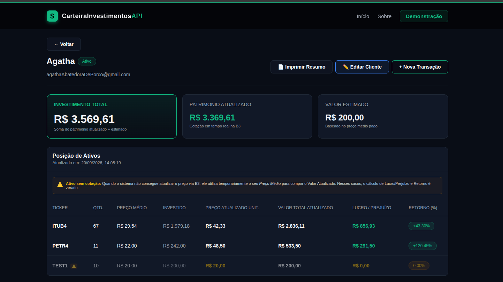
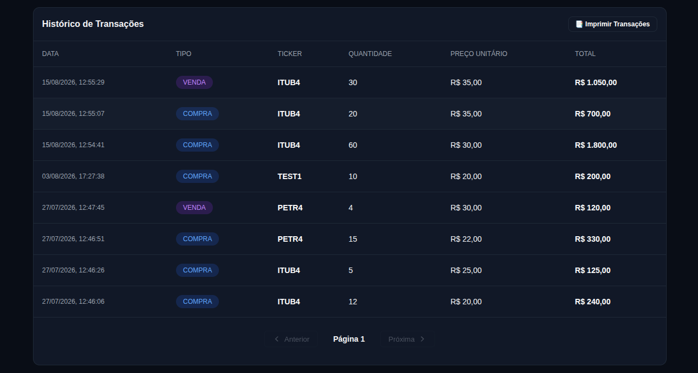

# 📈 CarteiraInvestimentos - Web API

<p align="center">
  
  
  
  
  
</p>

API REST desenvolvida em .NET 10 para gerenciamento de carteiras de investimentos em ativos negociados na B3, a fim de consolidar boas práticas de arquitetura e integração com serviços externos.

A aplicação permite cadastrar clientes, registrar operações de compra e venda, consultar o histórico de transações e consolidar automaticamente a carteira utilizando cotações obtidas pela Brapi. O projeto utiliza MongoDB e segue a Arquitetura Hexagonal (Ports and Adapters), mantendo o domínio desacoplado da infraestrutura.

---

## 🚀 Funcionalidades

- **Gerenciamento de clientes:** cadastro, consulta, atualização, ativação e inativação.
- **Registro de transações:** operações de Compra e Venda de ativos.
- **Histórico de operações:** consulta das transações realizadas por um cliente.
- **Consolidação da carteira:** cálculo de quantidade, preço médio, valor investido, valor atual e rentabilidade dos ativos.
- **Cotações atualizadas:** integração com a API Brapi para obtenção dos preços atuais dos ativos.

---

## 🛠️ Tecnologias

- **.NET 10 / C#**
- **MongoDB**
- **MongoDB.Driver**
- **Flurl**
- **Docker**
- **Scalar**
- **HTML / CSS / JavaScript**
- **Tailwind CSS**

### Arquitetura e conceitos

- Ports and Adapters (Arquitetura Hexagonal)
- Domain-Driven Design
- Princípios SOLID
- Injeção de Dependência
- Repository Pattern
- DTOs
- Programação Orientada a Objetos
- REST

---

## 🏗️ Estrutura do Projeto

A estrutura abaixo organiza a aplicação separando as responsabilidades, a fim de manter baixo acoplamento e isolar o núcleo de negócios (domínio) das ferramentas de tecnologia (infraestrutura).

```text
.
├── 📁 CarteiraInvestimentosAPI/
│   ├── 📁 Adapters/
│   │   ├── 📁 Controllers/
│   │   └── 📁 Infrastructure/
│   │       ├── 📁 ExternalServices/
│   │       ├── 📁 Repositories/
│   │       └── 📄 GlobalExceptionHandler.cs
│   │
│   ├── 📁 Domain/
│   │   ├── 📁 Entities/
│   │   ├── 📁 Exceptions/
│   │   └── 📁 Services/
│   │       └── 📁 Ports/
│   │
│   ├── 📁 Dtos/
│   │   ├── 📁 CustomersDtos/
│   │   └── 📁 WalletDtos/
│   │
│   └── 📄 Program.cs
│
├── 📁 front-end/
└── 📄 README.md
```

---

## ⚙️ Configuração do Ambiente Local

### Pré-requisitos

- [.NET 10 SDK](https://dotnet.microsoft.com/)
- [Docker](https://www.docker.com/)
- Chave da API Brapi *(opcional para consultas públicas, utilizada neste projeto para rastreabilidade)*

### 1. Clonar o projeto

```bash
git clone https://github.com/RyanSS27/CarteiraInvestimentosAPI.git
cd CarteiraInvestimentosAPI
dotnet restore
```

### 2. Executar o MongoDB

O projeto utiliza MongoDB executado através do Docker:

```bash
docker run -d -p 27017:27017 --name mongodb-carteira mongo:latest
```

O banco é executado localmente na porta padrão `27017`.

### 3. Configurar User Secrets

As informações de conexão com o MongoDB e a chave da Brapi não são armazenadas no repositório.

Configure os valores utilizando o **User Secrets** do .NET:

```bash
dotnet user-secrets set "CarteiraInvestimentosAPI:ConnectionString" "mongodb://localhost:27017"
dotnet user-secrets set "Brapi:Token" "SUA_CHAVE_AQUI"
```

As demais configurações permanecem no `appsettings.json`:

```json
{
  "CarteiraInvestimentosAPI": {
    "DatabaseName": "CarteiraInvestimentos",
    "CustomersCollectionName": "Customers",
    "TransactionsCollectionName": "Transactions"
  },
  "Brapi": {
    "BaseUrl": "https://brapi.dev/api/v2/stocks/quote"
  }
}
```

### 4. Executar a aplicação

```bash
dotnet run
```

---

## 🧪 Como utilizar a API

A API possui documentação interativa através do **Scalar**, que pode ser utilizada para visualizar e testar os endpoints.

### Principais endpoints

| Método | Rota | Descrição |
| :--- | :--- | :--- |
| **POST** | `/api/customer` | Cadastra um novo cliente |
| **GET** | `/api/customer/{id}` | Consulta um cliente |
| **POST** | `/api/wallet/{customerId}/transactions` | Registra uma transação |
| **GET** | `/api/wallet/{customerId}/transactions` | Consulta o histórico de transações |
| **GET** | `/api/wallet/{customerId}/summary` | Consulta a posição consolidada da carteira |

### 1. Cadastrar cliente

**POST**

```text
/api/customer
```

**Body:**

```json
{
  "name": "Ryan Souza",
  "email": "ryan@email.com"
}
```

### 2. Registrar uma transação

**POST**

```text
/api/wallet/{customerId}/transactions
```

**Body:**

```json
{
  "ticker": "PETR4",
  "quantity": 10,
  "unitPrice": 40.50,
  "transactionType": "BUY"
}
```

Os tipos de operação disponíveis são:

- `BUY` (ou 0) — compra
- `SELL` (ou 1) — venda

### 3. Consultar transações

**GET**

```text
/api/wallet/{customerId}/transactions?limit=10
```

Retorna o histórico de operações do cliente, limitado pela quantidade informada na consulta.

### 4. Consultar a carteira

**GET**

```text
/api/wallet/{customerId}/summary
```

A consulta consolida as informações dos ativos e, quando disponível, utiliza a cotação atual obtida através da Brapi, somada no atributo `totalValueUpToDate`.

Quando não há correspondência no mercado ao ticker informado ou ocorre uma falha nos serviços externos, o preço médio pago pelas ações é utilizado como referência. Nesses casos, os dados referentes ao lucro dos ativos são zerados e os valores são somados separadamente no atributo `totalValueEstimated`.

Exemplo simplificado:

```json
{
  "totalValue": 1407.44,
  "totalValueUpToDate": 1207.44,
  "totalValueEstimated": 200,
  "calculationDate": "2026-08-04T12:53:48.7100279Z",
  "assetsOut": [
    {
      "ticker": "ITUB4",
      "currentQuantity": 17,
      "averagePrice": 21.47,
      "currentAmountInvested": 364.99,
      "currentMarketPrice": 43.17,
      "totalCurrentValue": 733.89,
      "returnPercentage": 101.07,
      "profitOrLoss": 368.90,
      "isPriceUpToDate": true
    },
    {
      "ticker": "PETR4",
      "currentQuantity": 11,
      "averagePrice": 22.00,
      "currentAmountInvested": 242.00,
      "currentMarketPrice": 43.05,
      "totalCurrentValue": 473.55,
      "returnPercentage": 95.68,
      "profitOrLoss": 231.55,
      "isPriceUpToDate": true
    },
    {
      "ticker": "TEST1",
      "currentQuantity": 10,
      "averagePrice": 20.00,
      "currentAmountInvested": 200.00,
      "currentMarketPrice": 20.00,
      "totalCurrentValue": 200.00,
      "returnPercentage": 0,
      "profitOrLoss": 0,
      "isPriceUpToDate": false
    }
  ]
}
```

---

## 🖥️ Demonstração

O projeto também possui uma interface web para demonstrar visualmente o funcionamento da API.

O frontend apresenta a carteira consolidada, o histórico de transações e as principais informações retornadas pela aplicação.

### Carteira e posição dos ativos

<p align="center">
  
</p>

### Histórico de transações

<p align="center">
  
</p>

Para executar a demonstração, inicie a API e ajuste a porta utilizada no arquivo:

```text
front-end/script.js
```

```javascript
const API_BASE = 'http://localhost:5004/api';
```

Substitua `5004` pela porta em que a API estiver sendo executada e abra o arquivo `front-end/index.html`.

---

## 📊 Integração com a Brapi

A aplicação consulta a **Brapi** para obter as cotações atuais dos ativos.

Embora a API forneça diversas informações sobre cada ativo, a aplicação utiliza apenas os dados necessários para a consolidação da carteira, como:

- Ticker;
- Preço atual.

A chave utilizada nas consultas é armazenada através do **User Secrets**, evitando sua exposição no código-fonte.

---

## 🗄️ Persistência

Os dados são persistidos em duas coleções utilizando o `MongoDB.Driver`:

- `Customers`
- `Transactions`

O banco é executado localmente através de um container Docker.

---

## 🏁 Conclusão

Este projeto demonstra a implementação de uma API REST para gerenciamento de carteiras de investimentos utilizando **.NET 10**, **MongoDB** e **Arquitetura Hexagonal**.

O código foi organizado priorizando separação de responsabilidades, baixo acoplamento e facilidade de manutenção, servindo como uma demonstração prática da aplicação desses conceitos em um projeto realista.
